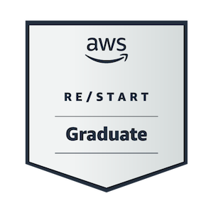
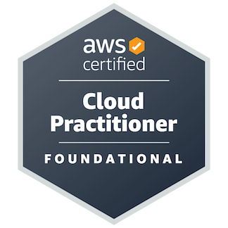
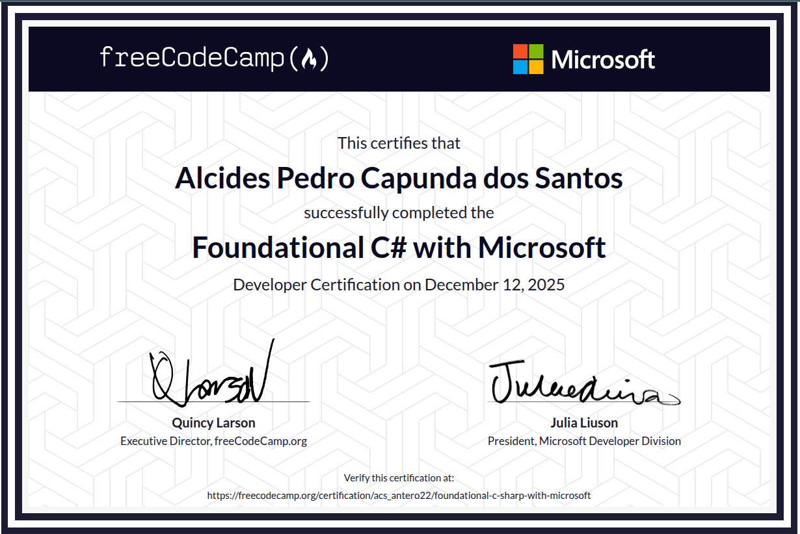

# Olá, eu sou o Alcides dos Santos! 👋

### Desenvolvedor Back-end .NET & Cloud Enthusiast

Sou um desenvolvedor focado no ecossistema **.NET (C#)** e em soluções de **Cloud Computing (AWS)**. Tenho experiência prática no desenho de APIs RESTful escaláveis, arquiteturas modernas (Vertical Slice, Clean Architecture, CQRS) e sistemas orientados a eventos (EDA) usando Docker, Mensageria e serviços AWS.

---

# 🏅 Certificações

<table>
  <tr>
    <!-- Badge da AWS Restart Graduate -->
    <td width="33%" align="center">
      
        
      AWS Restart Graduate
    </td>
    <!-- Badge da AWS Cloud Practitioner (CLF-C02) -->
    <td width="33%" align="center">
      
        
      AWS Cloud Practitioner (CLF-C02)
    </td>
    <!-- Foundational C# with Microsoft -->
    <td width="33%" align="center">
      
        
      Foundational C# with Microsoft
    </td>
  </tr>
</table>

---

### 🛠️ Competências Técnicas & Stacks

#### 💻 Desenvolvimento Back-end

&nbsp;
&nbsp;
&nbsp;
&nbsp;

#### ☁️ Cloud & DevOps

&nbsp;
&nbsp;
&nbsp;

#### 🗄️ Bases de Dados & Ferramentas

&nbsp;
&nbsp;
&nbsp;

---

### 🚀 Projetos em Destaque

#### 💳 [NotifAI - Sistema de Alertas de Transações](https://github.com/alcideskapunda/NotifAI)

Arquitetura Orientada a Eventos (EDA) dividida em microsserviços para processamento assíncrono de transações financeiras.

- **Destaques:** Web API em .NET 10, Worker Services para consumo de filas de forma resiliente, persistência em **AWS DynamoDB** de baixa latência e simulação Cloud local via **LocalStack**.
- **Tecnologias:** C#, .NET 10, ASP.NET Core, AWS SQS, DynamoDB, LocalStack, Docker.
- [Aceder ao Repositório ➔](https://github.com/alcideskapunda/NotifAI)

#### 📈 [CapitalFlow - Compra Programada de Ações](https://github.com/alcideskapunda/CapitalFlow)

Motor de processamento distribuído em .NET para automação de aportes e rebalanceamento de carteiras com dados reais da B3.

- **Destaques:** Organização em **Vertical Slice Architecture**, padrões CQRS, REPR e mensageria distribuída de eventos fiscais com **Apache Kafka**.
- **Tecnologias:** .NET 10, FastEndpoints, Entity Framework Core 9, MySQL, Kafka, Hangfire, Docker.
- [Aceder ao Repositório ➔](https://github.com/alcideskapunda/CapitalFlow)

---

### 🤝 Conecta-te Comigo

- **LinkedIn:** [linkedin.com/in/alcideskapunda22](https://www.linkedin.com/in/alcideskapunda22/)
- **E-mail:** [alcideskapunda22@gmail.com](mailto:alcideskapunda22@gmail.com)
